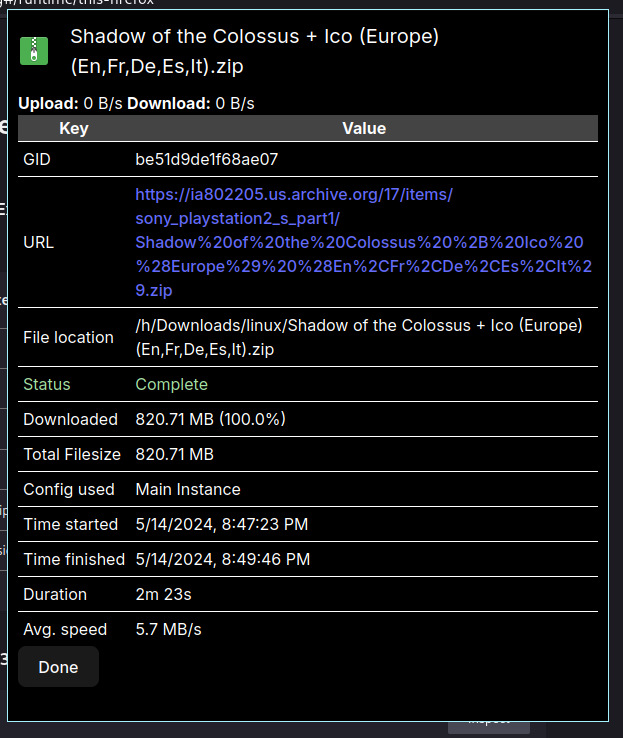
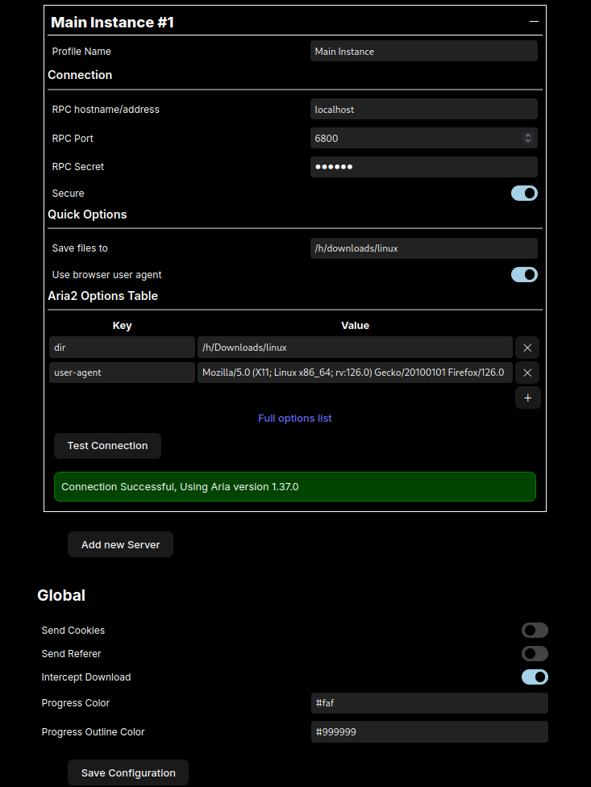

  
  <h1>Integrated Aria2 Download Manager</h1>

 

## Screenshot

  
Click to expand!

   

 
 

## Features

- Intercept download - Forward download from the browser to the aria2 instance.
- Automatic fetching - When it downloads metadata files such as `.torrent` or
  `.metalink` it'll automatically download the files specified inside.
- Download history - Every time download finished, the history will be saved and
  not lost when you close the browser.
- Pie progress indicator - Show pie progress on the browser toolbar (need to pin
  the extension first)
- Customizable - Progress color can be customized to any color (very game
  changing)
- Hotkey - keyboard shortcut is available
- Fallback server - Add another server configuration as a fallback if the main
  one fail. Program will try to connect from top to bottom order in the options.
- Cross Browser - Works in both firefox or chromium based browsers.

## Guides

  
Setup self-signed ssl/tls certificate in firefox

   

1. Run `genssl.sh` script in the `scripts` folder to generate certificates.
2. Add `root-ca.pem` to Authorities in certificate manager (search for "view
   certificates" in the firefox settings) and check
   `This certificate can identify website` when importing
3. If still not work, try disabling
   `security.certerrors.mitm.auto_enable_enterprise_roots` and
   `security.enterprise_roots.enabled` in `about:config`
4. Finally run
   `aria2c --enable-rpc --rpc-secret=topsecret --rpc-certificate=server.p12 --rpc-secure`

  
Setup self-signed ssl/tls certificate in chromium

   

1. Run `genssl.sh` script in the `scripts` folder to generate certificates.
2. Add `root-ca.pem` to Authorities tab in Manage certificates (search for
   "manage certificates" in the search bar) and check
   `Trust this certificate for identifying websites` when importing
3. Finally run
   `aria2c --enable-rpc --rpc-secret=topsecret --rpc-certificate=server.p12 --rpc-secure`

## Known issues

- In chromium based browser on windows, downloaded files will be saved in path
  relative to working directory of aria2. Set `Save files to` in the quick
  options to fix this issue.
- If you got `socket error` when using aria2 cli in Windows try adding
  `--disable-ipv6` flag.

## Building

`Node.js` v18 or newer should work.

1. `pnpm install` or `npm install`
2. `npm run build`

`dist` folder will be generated in the root of the project directory with
`firefox` and `chromium` folder inside.

## Contributing and feature request

Any contribution are welcome, fork and send me a pull request! For any
suggestion or issue you can create a new issue in the issue panel.
